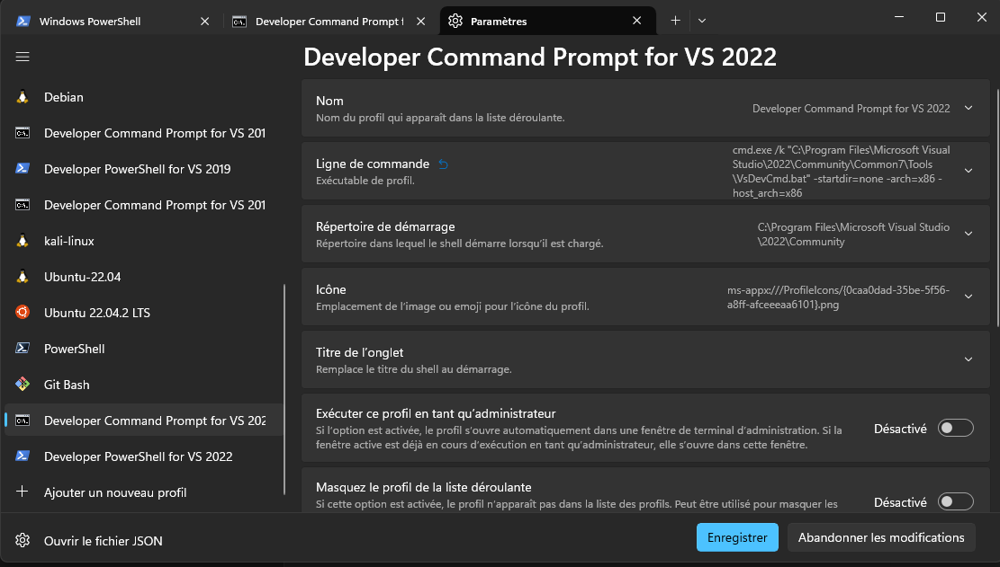

# reverse_5a

## Installation de l'environnement

* Un OVA Windows 11 est disponible ici: <https://developer.microsoft.com/en-us/windows/downloads/virtual-machines/>

* Installer preview terminal <https://apps.microsoft.com/detail/9N8G5RFZ9XK3?hl=fr-fr&gl=FR>

* Vscode + environnement de [compilation](https://code.visualstudio.com/docs/cpp/config-msvc)

* Modifier l'environnement de compilation dans les parametres de preview terminal: changer x64 en x86 dans _ligne de commande_ et cliquer sur enregistrer

* Installer Ghidra <https://ghidra-sre.org/InstallationGuide.html> 

## Use cases

* helloword classique

* helloword avec copy de chaine de caractères

* Fonction d'addition et de concaténation

* fonction d'initialisation d'un tableau de 256 caracteres

* programme avec API Windows qui écrit dans un fichier
